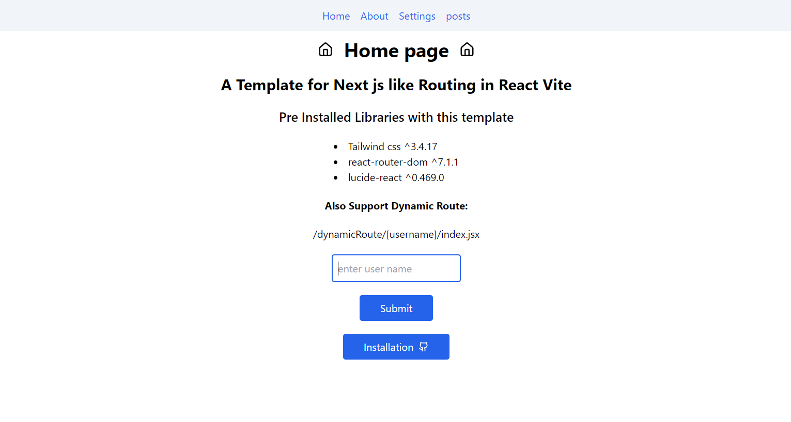

# Template

### React Vite + File Based Routing

- A Template for Next js like Routing in React Vite Based on  [this blog](https://omarelhawary.me/blog/file-based-routing-with-react-router-upgrading-to-v6)

Routes:

- /pages/index.jsx => "/"
- /pages/about.jsx => "/about"
- /pages/posts/index.jsx => "/post"
- /pages/posts/post1.jsx => "/post/post1"
- /pages/dynamicRoute/[username]/index.jsx => "/dynamicRoute/userName/"

### Pre Installed Libraries with this template

- Tailwind css ^3.4.17
- react-router-dom ^7.1.1
- lucide-react ^0.469.0

### Clone Project

create a folder and clone this repo

```bash
git clone https://github.com/iamvkr/vite-filebased-routing.git
```

### Homepage

